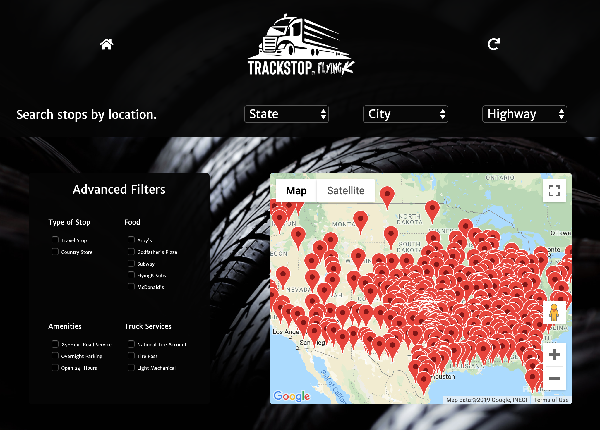

# TrackStop by Flying K

TrackStop allows users to search information about truck stops across the United States. The application allows for extensive search queries based on criteria such as state, city, highway, and more.

## Features

---

- Dropdown boxes that allow users to search by location.
- Locations are filtered to match the queries; for example, if the user selects California, the user will receive only cities and highways that are in California.

- The application is integrated with Google Maps, so that users may view selected locations on the map.

- Users have the ability to designate options from a plethora of truck services, destination types, amenities, and restaurants.

- Comprehensive profiles of each destination are highlighted upon selection, providing users with an overview of the location.

## Technologies

- [React](https://reactjs.org/)
- [Redux](https://redux.js.org/)
- [Google Maps](https://www.npmjs.com/package/google-maps-react)
- [PostgresQL](https://www.postgresql.org/)
- [Heroku](https://www.heroku.com)
- Javascript
- HTML
- CSS

## Link

---

[TrackStop](http://ccx-react-b-project-staging.herokuapp.com/)

## Authors

---

[Daniel](https://github.com/furugura)

[Eugene](https://github.com/eugenekim000)

[Nao](https://github.com/NaoArimura)

[Vic](https://github.com/sidiousvic)
